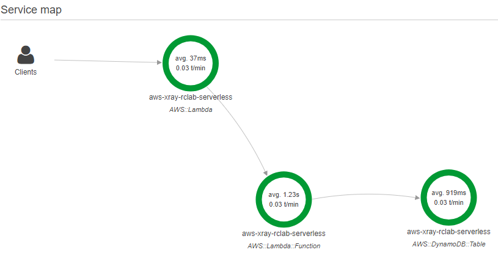
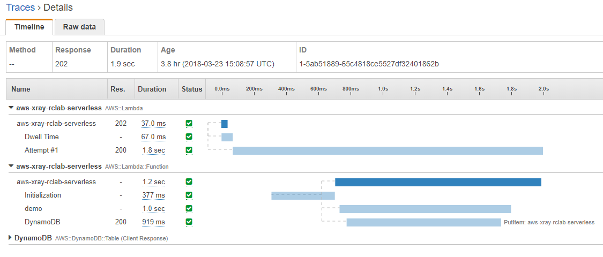

# aws-xray-lambda-nodejs
Demo para analizar aplicaciones con AWS x-ray con el que podrías encontrar la causa raíz de los problemas y/o rendimiento.

# 
# 

# Arquitectura
# 

# Pasos simples
* Instalar el módulo de x-ray para nodejs
* Subir el código comprimido en zip a s3
* Crear el stack en CloudFormation

# Instalación
Se debe ejecutar la plantilla en CloudFormation para crear los recursos, donde se utiliza S3 como trigger para ejecutar una función Lambda quien inserta un registro en DynamoDB, todo este proceso está monitoreado por AWS x-ray.

Se instala el SDK del X-Ray con npm
```bash 
npm install aws-xray-sdk
```

>Puedes instalar el módulo de X-Ray con npm usando un contenedor chainio/lambda-ci-nodejs6.10

>```bash
>docker run -ti --privileged -v C:\Users\rctaptap\laboratorios:/data --name node_01 -d chainio/lambda-ci-nodejs6.10 /bin/bash
>docker exec -ti node_01 bash
>```

Una vez subido el archivo comprimido en .zip a s3 se ejecuta la plantilla en el servicio CloudFormation desde la consola web o con AWS CLI con el siguiente comando:
```bash
aws cloudformation deploy --template-file template.yaml --stack-name aws-xray-lambda-nodejs --parameter-overrides Owner=und Project=xray Environment=demo Type=serverless SourceBucketName="[bucketSource]" SourceBucketKey="[rctaptap/aws-xray-s3-demo.zip]" --capabilities CAPABILITY_NAMED_IAM --region ap-northeast-1 
```

# [Detalle del código](https://github.com/OrbisVentures/aws-xray-lambda-nodejs/blob/master/index.js)

Para enviar la información a x-ray se debe activar la opción "Enable active tracing", lo cual se hace en el template para cloudformation.

```YAML
TracingConfig:
    Mode: Active 
```

Y se debe iniciar el método de “capture calls” del SDK al llamar a los servicios de aws, de está forma cualquier llamado a los diferentes servicios (SQS, SNS, DynamoBD) será registrado en x-ray.

```javascript
var xray = require("aws-xray-sdk");
var aws = xray.captureAWS(require("aws-sdk"));
```

Ya si se desea un mayor detalle se puede insertar datos como si estuvieramos haciendo un console.log llamando al getSegment() que trae el “segment actual” que es inmutable (o sea, iniciado por el ALB/APIGw, o lo que sea...) y el addAnnotation() agrega una nota el segment.

```javascript
var demo_segment = xray.getSegment().addNewSubsegment("demo");
demo_segment.addAnnotation("Object", object);
```

Con el addMetadata, también puedes agregar cualquier otro objeto el trace, aún que no sea “searchable”.

```javascript
demo_segment.addMetadata(object, data);
```
  
Después de finalizar el proceso y cerrar el callback, también cerramos el segment. Debes hacerlo con cualquier segment que sea customizado, mientras los segmentos “inmutables” van a ser cerrados por el propio SDK.

```javascript
demo_segment.close();
callback(null, "done");
```

Eso es básicamente todo lo que requiere el SDK de X-Ray. De ahí, creo que puedes avanzar en hacer testeos.

Es interesante también mirar el ejemplo q tenemos (también en node...): [xray node express sample](https://github.com/aws-samples/eb-node-express-sample/tree/xray)

# Detalle del template
La pantilla tiene 3 secciones y la creación de los recursos necesarios.

```YAML
Description: Function Lambda to execute whit S3 and DynamoDB to send trace to XRAY
Parameters: ...
Resources: 
    MyLambdaFunction:
    LambdaExecutionRole:
    BucketSource:
    LambdaInvokePermission:
    TableDest:
```    
# Parameters

```YAML
Parameters:
  Owner:
    Type: String
    Default: und
  Project:
    Type: String
    Default: xray
  Environment:
    Type: String
    Default: demo
  Type:
    Type: String
    Default: serverless
```    
Los parámetros de entrada son utilizados para ingresar el nombre de la función, s3, role IAM, política inline y la tabla dynamoDB.

* Función: und-xray-demo-serverless
* S3: und.xray.demo.serverless
* Role IAM: und.xray.demo.serverless
* Política Inline: und.xray.demo.serverless.[service]
* Tabla: und-xray-demo-serverless

# Resources
## MyLambdaFunction
```YAML
MyLambdaFunction:
    Type: "AWS::Lambda::Function"
    Properties:
      FunctionName : !Join
        - "-"
        - - !Sub ${Owner}
          - !Sub ${Project}
          - !Sub ${Environment}
          - !Sub ${Type}
      Handler: index.handler
      Runtime: nodejs6.10
      Code:
        S3Bucket: "bucket"
        S3Key: "rctaptap/aws-xray-lambda-nodejs.zip"
      Role: !GetAtt LambdaExecutionRole.Arn
      Description: "Amazon function to send traces to xray with S3 and DynamoDB"
      MemorySize: 128
      Timeout: 3
      TracingConfig:
        Mode: Active 
      Environment:
        Variables:
          my_table: !Ref TableDest
    DependsOn: 
      - TableDest
      - LambdaExecutionRole
```    
## LambdaExecutionRole
```YAML
 LambdaExecutionRole:
    Type: AWS::IAM::Role
    Properties:
      RoleName : !Join
        - "."
        - - !Sub ${Owner}
          - !Sub ${Project}
          - !Sub ${Environment}
          - !Sub ${Type}
      AssumeRolePolicyDocument:
        Version: '2012-10-17'
        Statement:
        - Effect: Allow
          Principal:
            Service:
            - lambda.amazonaws.com
          Action:
          - sts:AssumeRole
      Path: "/"
      Policies:
      - PolicyName: !Join
        - "."
        - - !Sub ${Owner}
          - !Sub ${Project}
          - !Sub ${Environment}
          - !Sub ${Type}
          - "cloudwatchlogs"
        PolicyDocument: 
          Version: "2012-10-17"
          Statement: 
            - Effect: "Allow"
              Action:
                - logs:CreateLogGroup
                - logs:CreateLogStream
                - logs:PutLogEvents
              Resource: "*"
      - PolicyName: !Join
        - "."
        - - !Sub ${Owner}
          - !Sub ${Project}
          - !Sub ${Environment}
          - !Sub ${Type}
          - "dynamodb"
        PolicyDocument: 
          Version: '2012-10-17'
          Statement:
            - Effect: Allow
              Action:
                - 'dynamodb:DeleteItem'
                - 'dynamodb:GetItem'
                - 'dynamodb:PutItem'
                - 'dynamodb:Scan'
                - 'dynamodb:UpdateItem'
              Resource: !GetAtt TableDest.Arn
      - PolicyName: !Join
        - "."
        - - !Sub ${Owner}
          - !Sub ${Project}
          - !Sub ${Environment}
          - !Sub ${Type}
          - "xray"
        PolicyDocument: 
          Version: '2012-10-17'
          Statement:
            - Effect: Allow
              Action:
                - 'xray:PutTraceSegments'
                - 'xray:PutTelemetryRecords'
              Resource: "*"
    DependsOn: TableDest
```    
## BucketSource
```YAML
BucketSource:
    Type: 'AWS::S3::Bucket'
    Properties:
      BucketName: !Join
        - "."
        - - !Sub ${Owner}
          - !Sub ${Project}
          - !Sub ${Environment}
          - !Sub ${Type}
      NotificationConfiguration:
        LambdaConfigurations:
            - Function: !GetAtt MyLambdaFunction.Arn
              Event: "s3:ObjectCreated:*"
    DependsOn: 
      - LambdaInvokePermission
```    
## LambdaInvokePermission
```YAML
LambdaInvokePermission:
    Type: 'AWS::Lambda::Permission'
    Properties:
      FunctionName: !GetAtt MyLambdaFunction.Arn
      Action: 'lambda:InvokeFunction'
      Principal: s3.amazonaws.com
      SourceAccount: !Ref 'AWS::AccountId'
      SourceArn: !Join
        - ":"
        - - "arn"
          - "aws"
          - "s3"
          - ":"
          - !Join
            - "."
            - - !Sub ${Owner}
              - !Sub ${Project}
              - !Sub ${Environment}
              - !Sub ${Type}
    DependsOn: 
      - MyLambdaFunction
```    
## TableDest
```YAML
TableDest:
    Type: 'AWS::DynamoDB::Table'
    Properties:
      AttributeDefinitions:
        - AttributeName: id
          AttributeType: S
      KeySchema:
        - AttributeName: id
          KeyType: HASH
      ProvisionedThroughput:
        ReadCapacityUnits: 5
        WriteCapacityUnits: 5
      TableName: !Join
        - "-"
        - - !Sub ${Owner}
          - !Sub ${Project}
          - !Sub ${Environment}
          - !Sub ${Type}
```    

